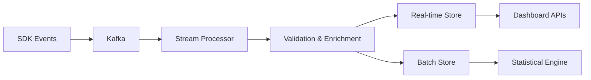
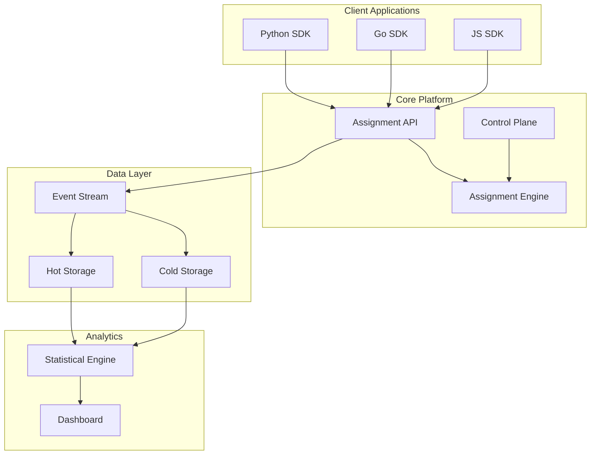

# Experimentation Platform Design - Feature Specifications

## 1. Flagging SDK

### Core MVP Features
- **Multi-language SDKs** (Python, Go, JavaScript, Java)
- **Synchronous flag evaluation** with configurable timeouts (100ms default)
- **Local caching** with TTL-based invalidation (5-minute default)
- **Graceful degradation** - return default values on service unavailability
- **Context passing** - user ID, session ID, device type, geo, custom attributes

### API Design
```python
# Core interface
client = ExperimentClient(api_key="...", environment="prod")

# Simple A/B test
variant = client.get_variant("checkout_flow_v2", user_id="123", 
                           default="control")

# With rich context
context = {
    "user_id": "123",
    "segment": "premium", 
    "device": "mobile",
    "geo": "US-CA"
}
variant = client.get_variant_with_context("recommendation_algo", 
                                        context, default="baseline")
```

### Advanced Features (Stretch)
- **Asynchronous evaluation** for high-throughput services
- **Bulk evaluation** for batch processing
- **Real-time config updates** via WebSocket connections
- **Client-side evaluation** with secure flag downloading

## 2. Control Plane

### MVP Features
- **Experiment CRUD operations** via REST API and web UI
- **Traffic allocation management** with percentage splits
- **Targeting rules** based on user attributes (AND/OR logic)
- **Environment management** (dev, staging, prod isolation)
- **Basic RBAC** (read, write, admin roles)

### Data Models
```yaml
Experiment:
  id: string
  name: string
  description: string
  status: [draft, running, paused, completed]
  type: [ab_test, multivariate, multi_armed_bandit]
  traffic_allocation: float (0-1)
  
Variant:
  experiment_id: string
  name: string
  allocation: float
  parameters: map<string, any>
  
TargetingRule:
  experiment_id: string
  attribute: string
  operator: [equals, in, greater_than, less_than, regex]
  values: array
```

### Web UI Components
- **Experiment dashboard** with status overview
- **Visual traffic allocation editor** (drag-and-drop sliders)
- **Targeting rule builder** with preview functionality
- **Real-time metrics dashboard** showing conversion rates
- **Experiment lifecycle management** (start/stop/archive)

### Advanced Features (Stretch)
- **Git-based configuration** with approval workflows
- **Experiment templates** for common patterns
- **Advanced targeting** with ML-based audience segmentation
- **Automated QA checks** before experiment launch

## 3. Assignment Engine

### MVP Architecture
- **Stateless service** for horizontal scaling
- **Deterministic hashing** using user_id + experiment_id for consistent assignment
- **Traffic filtering** based on allocation percentage
- **Rule evaluation engine** for targeting criteria

### Core Algorithm
```python
def assign_variant(experiment, user_context):
    # 1. Check if user meets targeting criteria
    if not evaluate_targeting_rules(experiment.rules, user_context):
        return None
    
    # 2. Determine if user is in experiment traffic
    hash_input = f"{user_context['user_id']}:{experiment.id}"
    traffic_hash = murmurhash3(hash_input) % 10000
    if traffic_hash >= experiment.traffic_allocation * 10000:
        return None
    
    # 3. Assign to variant based on allocation
    variant_hash = murmurhash3(hash_input + ":variant") % 10000
    cumulative = 0
    for variant in experiment.variants:
        cumulative += variant.allocation * 10000
        if variant_hash < cumulative:
            return variant
    
    return experiment.control_variant
```

### Performance Requirements
- **Sub-10ms P99 latency** for assignment decisions
- **10K+ QPS** per instance capability
- **99.99% availability** with circuit breakers
- **Consistent assignments** across multiple calls

### Advanced Features (Stretch)
- **Multi-armed bandit assignment** with Thompson sampling
- **Contextual bandits** using feature vectors
- **Dynamic allocation updates** based on performance
- **Holdout groups** for measuring overall experiment impact

## 4. Data Pipeline

### MVP Components
- **Event ingestion** via Kafka/Pulsar for real-time streaming
- **Schema validation** for incoming events
- **Deduplication** based on event IDs
- **Batch processing** for daily aggregation using Apache Spark

### Event Schema
```json
{
  "event_id": "uuid",
  "timestamp": "2024-01-15T10:30:00Z",
  "user_id": "string",
  "experiment_id": "string", 
  "variant": "string",
  "event_type": "assignment|conversion|custom",
  "properties": {
    "revenue": 29.99,
    "custom_metric": "value"
  },
  "context": {
    "device": "mobile",
    "geo": "US-CA"
  }
}
```

### Storage Strategy
- **Hot data**: ClickHouse/BigQuery for real-time queries (last 30 days)
- **Cold data**: Parquet files in S3/GCS for historical analysis
- **Aggregated data**: Pre-computed daily/hourly rollups for dashboards

### Processing Pipeline


### Advanced Features (Stretch)
- **Real-time stream processing** for instant metric updates
- **Data quality monitoring** with automated alerting
- **Cross-device user stitching** for better attribution
- **Privacy-compliant data handling** (GDPR/CCPA)

## 5. Statistical Engine

### MVP Capabilities
- **Sample size calculation** using power analysis
- **Statistical significance testing** (t-tests, chi-square)
- **Confidence intervals** for conversion rates and means
- **Multiple testing correction** (Bonferroni, FDR)

### Core Metrics
```python
class ExperimentResults:
    sample_size: int
    conversion_rate: float
    confidence_interval: tuple[float, float]
    p_value: float
    statistical_power: float
    days_to_significance: int
    
    # For continuous metrics
    mean: float
    std_dev: float
    
    # For revenue metrics  
    revenue_per_user: float
    total_revenue: float
```

### Analysis Engine
- **Bayesian A/B testing** for more intuitive probability statements
- **Sequential testing** for early stopping decisions
- **Effect size calculations** (Cohen's d, relative lift)
- **Segment analysis** for understanding differential effects

### Reporting Features
- **Automated experiment reports** with key insights
- **Visualization widgets** for embedding in dashboards  
- **Export functionality** (PDF reports, CSV data)
- **Statistical significance alerts** via email/Slack

### Advanced Features (Stretch)
- **Causal inference** methods for observational data
- **Multi-armed bandit optimization** with regret minimization
- **Contextual bandit analysis** with feature importance
- **Long-term impact measurement** using difference-in-differences

## Architecture Overview

### System Components


### Technology Stack Recommendations

**MVP Stack:**
- **Backend**: Go/Python services with gRPC
- **Database**: PostgreSQL for metadata, ClickHouse for events
- **Message Queue**: Apache Kafka
- **Cache**: Redis for SDK caching
- **Frontend**: React with TypeScript
- **Infrastructure**: Kubernetes on cloud provider

**Scaling Stack:**
- **Stream Processing**: Apache Flink/Kafka Streams
- **Analytics**: Apache Spark, dbt for transformations
- **Monitoring**: Prometheus, Grafana, Jaeger
- **Security**: Vault for secrets, OAuth2/OIDC

## Implementation Phases

### Phase 1: MVP (8-12 weeks)
- Basic SDK with caching
- Simple A/B test support
- Web UI for experiment management
- Basic statistical analysis
- Event collection and storage

### Phase 2: Production Ready (4-6 weeks)
- Advanced targeting rules
- Performance optimization
- Monitoring and alerting  
- Security hardening
- Documentation and onboarding

### Phase 3: Advanced Features (8-12 weeks)
- Multi-armed bandits
- Contextual bandits
- Canary deployment integration
- Advanced analytics
- Enterprise features (SSO, audit logs)

This design provides a solid foundation that can scale from a simple A/B testing platform to a sophisticated experimentation engine supporting advanced use cases like contextual bandits and automated decision-making.